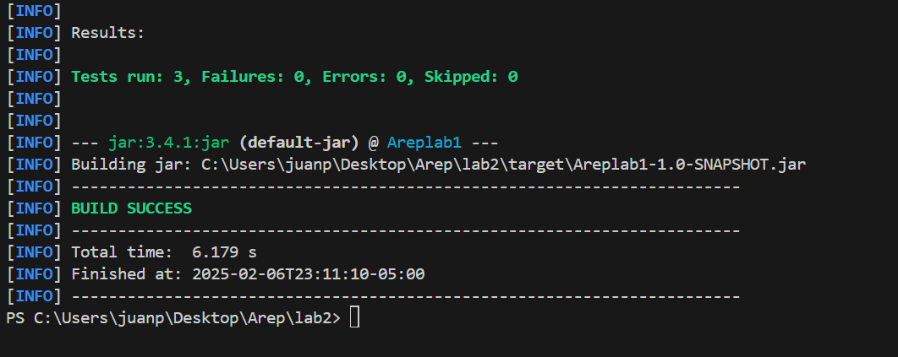

# Web Framework Development for REST Services and Static File Management

##  Introducción
Este proyecto tiene como objetivo mejorar un servidor web existente para convertirlo en un framework web funcional. Con esta implementación, el servidor podrá manejar servicios REST utilizando métodos GET y administrar archivos estáticos en una ubicación configurable.

---

##  Características Implementadas

###  Método `get()` para definir servicios REST
Se ha implementado un mecanismo para definir rutas REST mediante funciones lambda, permitiendo a los desarrolladores registrar rutas de manera sencilla.

####  Uso Ejemplo:
```java
get("/hello", (req, res) -> "hello world!");
```

####  Implementación
- Se utiliza un `Map<String, BiConsumer<Request, Response>>` para almacenar las rutas GET.
- Al recibir una solicitud, el servidor busca en el mapa si existe una función asociada a la ruta.
- Si la ruta existe, se ejecuta la función lambda y se devuelve la respuesta.


---

###  Extracción de Parámetros de Consulta
Se ha desarrollado un mecanismo para extraer parámetros de consulta de las solicitudes HTTP y hacerlos accesibles en los servicios REST.

####  Uso Ejemplo:
```java
get("/app/hello", (req, res) -> "hello " + req.getQueryParam("name"));
```

####  Implementación
- Se parsea la URL en la clase `Request`, separando el path de los parámetros de consulta.
- Se almacenan los parámetros en un `Map<String, String>` accesible mediante el método `getQueryParam()`.
- Permite manejar valores dinámicos en las respuestas REST.

---

###  Especificación de la Ubicación de Archivos Estáticos
Se ha añadido la función `staticfiles()` que permite definir la carpeta donde se encuentran los archivos estáticos.

####  Uso Ejemplo:
```java
staticfiles("src/main/static");
```


####  Implementación
- Se almacena la ruta base de los archivos estáticos.
- Al recibir una solicitud que no coincide con una ruta REST, el servidor busca el archivo en la carpeta configurada.
- Se determina el tipo de contenido (MIME) y se envía el archivo como respuesta.
- Si el archivo no existe, se devuelve un error `400 Bad Request` con una página de error predefinida.

---

##  ¿Cómo Probar el Framework?


###  Compilar y Ejecutar pruebas
```sh
mvn package
```


###  Acceder en el Navegador
-  Página estática: `http://localhost:35000/indexlab2.html`
-  Prueba de query params: `http://localhost:35000/app/hello?name=Juan`
-  Prueba de PI:`http://localhost:35000/app/pi`

Sin embargo, tambien esta preparado para responder a un nombre personalizado haciendo uso un javascript.

---

##  Conclusión
Este proyecto permite el desarrollo de aplicaciones web con servicios REST y manejo de archivos estáticos de manera flexible. Con la implementación del método `get()`, la extracción de parámetros y la configuración de archivos estáticos, se ha creado una base para construir aplicaciones web sobre este servidor en Java.

## Built With

[Maven](https://maven.apache.org/index.html) - Dependency Management

[Git](https://git-scm.com) - Version Control System

## Authors

Juan Pablo Fernandez Gonzalez
